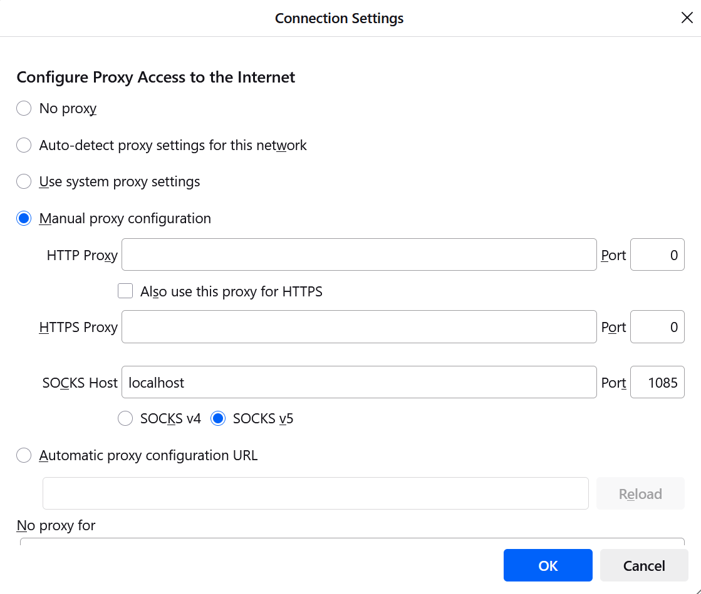

# Instruction on Doing a Cosmic Run

## Powering on computers
  
#### LV  
   
  - Click on OPS software  
  - Login using password 904ops  
  - Unless there is a complete shutdown, PVSS software will aways run, no reconfig needed  
  - Go to Vision 1   
  - Crate 1 controls ME/1/1, Crate 2 controls ME/1/2 etc.  
  - Select Crate 1 -> Change Crate -> Turn On 
  - All red should turn green 
  
#### HV  

  - Use UP/DOWN arrows to reach ME/1/1  
  - Hit SPACE bar to turn on   
  
## Software  

#### Terminal and Firefox 

  - In command terminal ssh -ND node (?) 1085 example username@cms904usr.cern.ch  
  - Enter your password  
  - If you need an account contact Karoly Banicz    
  - Navigate to Firefox  
  - Click on settings, scroll down, click on network settings  
  - Select Manual Proxy Configuration  
  - Inside SOCKS host, write localhost, port is the one you selected example 1085  
  - Select SOCKS v5 (should be default but ensure it is clicked) 

  - Once browser is configured, paste this url to access emu farmer page http://vmepc-e1x07-23-01.cms904:9399/emu/farmer/html/Default.html   
  - Click on try and configure (the second line pictured) 

#### Choosing duck files

Below are screenshots of the duck files that should be selected/enabled.

#### Configuration within EMU page
  
  - Poll
  - Go to emu::pc::EmuPeripheralCrateConfig.0
  - Check crate controllers, total crates 1, active crates 1 means we are communication  
  - Power up init button  
  - Check DMB status, we use version VE0_04 for taking the cosmic run, should already be on the boards  
  - CFED status, 1 to 7 should be all green

!!! note "If anything is red"

    Navigate to DMB Utils, power cycle the board. If this does not resolve the problem, find CFEB Utils and download firmware where necessary

#### Operating the X2O Boards   

  - Walk through this again and write down as we go

